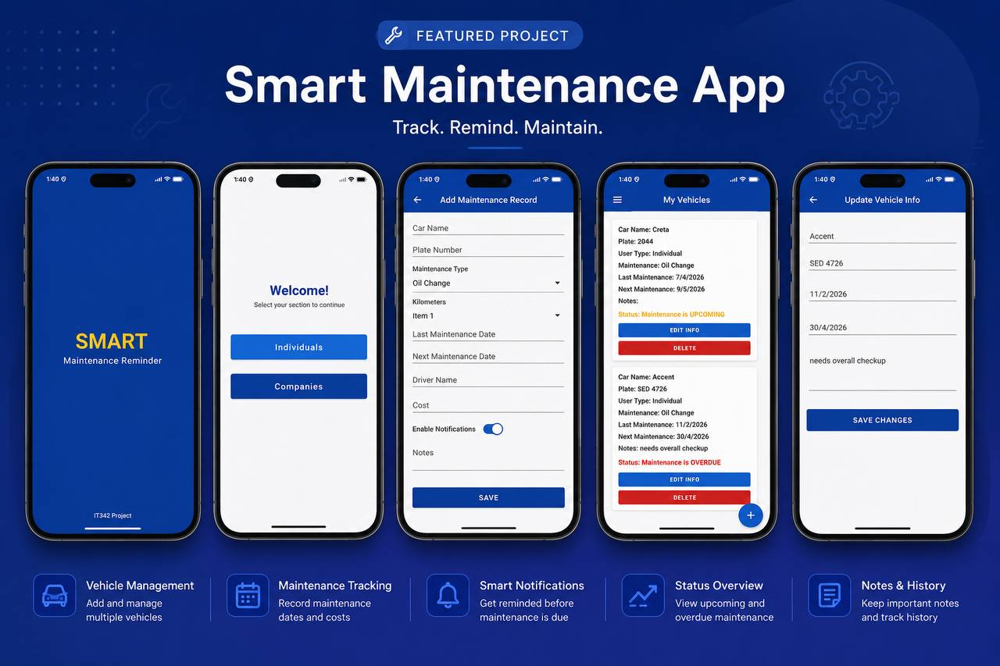

# Smart Maintenance Reminder

An Android application developed to help individuals and companies organize and track vehicle maintenance records efficiently. The application allows users to add, update, delete, and monitor vehicle maintenance information through a simple and user-friendly interface using Firebase Realtime Database.

---

## Features

- Vehicle maintenance management
- Support for Individuals and Companies
- Firebase Realtime Database integration
- Add, update, and delete maintenance records
- Maintenance status tracking (Upcoming / Overdue)
- User-friendly interface

---

## Technologies Used

- Java
- Android Studio
- Firebase Realtime Database
- XML
- Android SDK

---

## Application Screens

- Splash Screen
- User Type Selection
- Add Maintenance Record
- Vehicles List
- Vehicle Details
- Edit Vehicle Information

---

## Overview

The application helps users organize vehicle maintenance records, schedule upcoming maintenance, and monitor maintenance status to reduce missed services and improve vehicle management.

---

## Project Type

University Team Project developed as part of the **Mobile Cloud Computing** course.

---

## Team

This project was developed collaboratively by:

- Raghad Alhamad
- Lulu Almuqbil
- Thekra Alhuniny
- Sarah Alhawday
